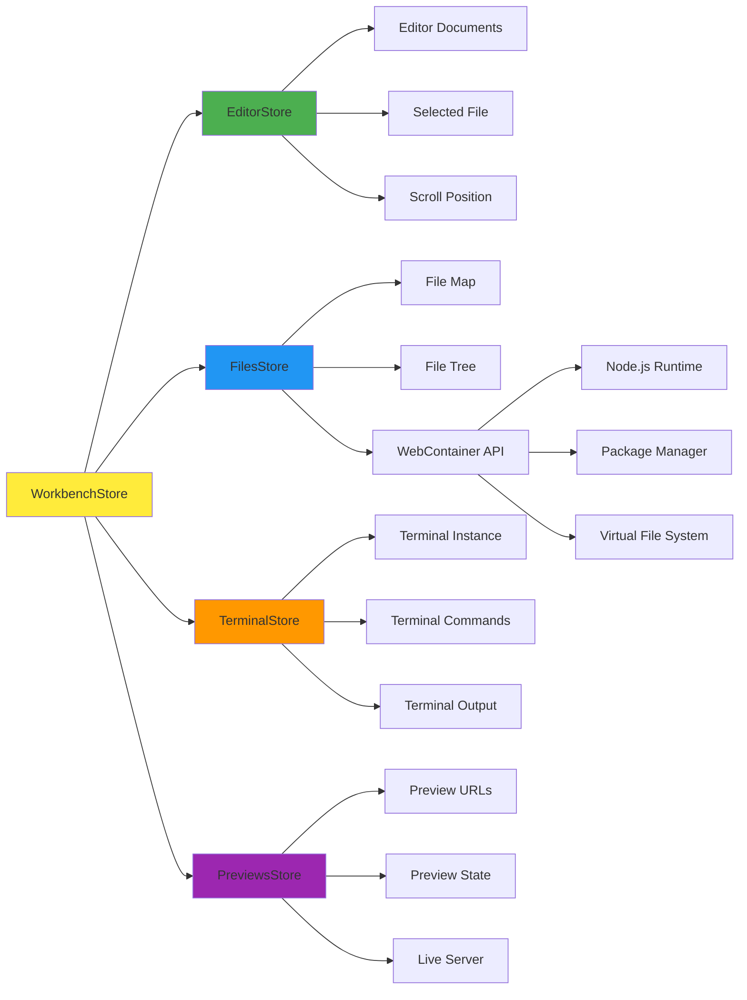
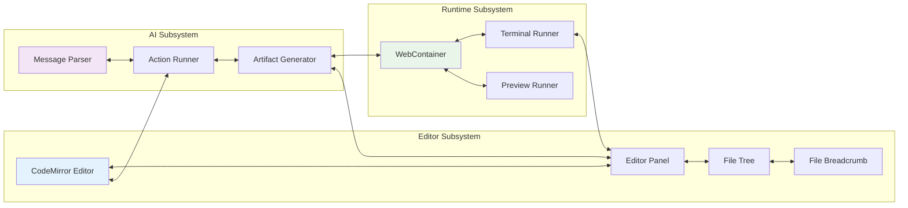
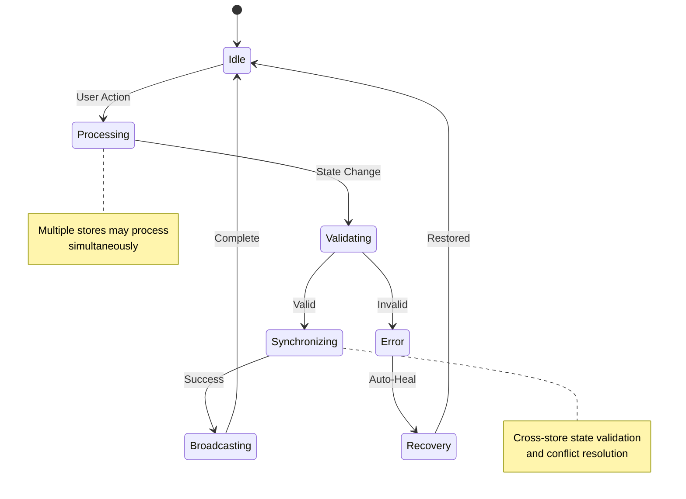
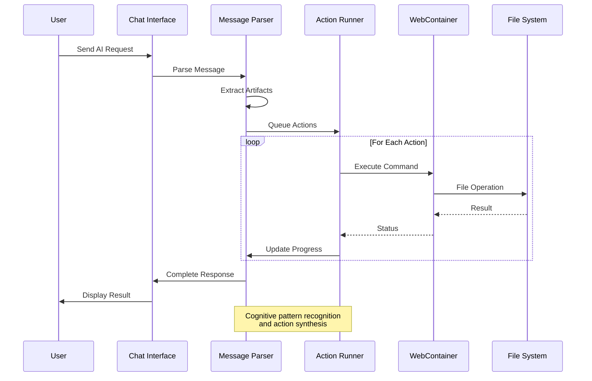

# Core Components Architecture

## Store Architecture - Cognitive Kernel Network

The store system forms the cognitive backbone of bolt-new, implementing a distributed cognition pattern through interconnected state management kernels.

## Component Interaction Patterns

### Bidirectional Synergies

## Emergent Cognitive Patterns

### 1. State Synchronization Network

The system maintains coherent state through a sophisticated synchronization pattern:

### 2. Attention Allocation Mechanism

The system implements adaptive attention through priority-based resource allocation:

**Priority Levels:**
1. **Critical**: File save operations, error handling
2. **High**: AI responses, user interactions
3. **Medium**: Background compilation, preview updates
4. **Low**: Cache optimization, prefetching

### 3. Recursive Implementation Pathways

Each component follows recursive patterns:

- **Self-Managing**: Components handle their own lifecycle
- **Self-Healing**: Automatic error recovery and state restoration
- **Self-Optimizing**: Performance tuning based on usage patterns

## Neural-Symbolic Integration Points

### Message Parser Integration

### Adaptive Synergy Optimization

The system continuously optimizes component interactions through:

1. **Performance Monitoring**: Track operation timing and resource usage
2. **Pattern Recognition**: Identify common workflow patterns
3. **Preemptive Loading**: Anticipate user needs and preload resources
4. **Dynamic Routing**: Route operations to optimal execution contexts

## Hypergraph-Centric Architecture

The component relationships form a hypergraph where:

- **Nodes**: Individual components and stores
- **Hyperedges**: Multi-component interactions and workflows
- **Weights**: Interaction frequency and importance
- **Dynamics**: Adaptive edge strength based on usage patterns

This enables:
- **Distributed Decision Making**: No single point of control
- **Emergent Intelligence**: System-level behaviors emerge from local interactions
- **Fault Tolerance**: Multiple pathways for achieving goals
- **Scalable Complexity**: New components integrate naturally