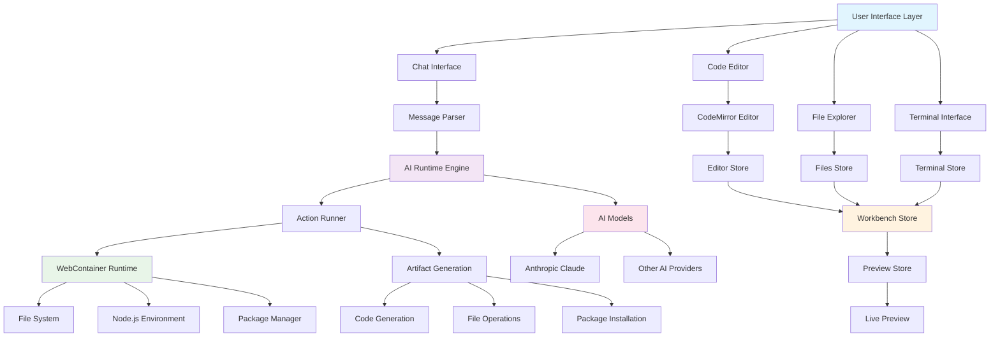

# System Overview

## High-Level Architecture

The bolt-new system is a cognitive AI-powered development environment that operates through emergent neural-symbolic integration patterns. The architecture follows recursive design principles with adaptive attention allocation mechanisms.

## Core Principles

### 1. Recursive System Mapping
The system employs recursive patterns where each component can spawn sub-processes and manage hierarchical state relationships:

- **Cognitive Kernels**: Each store acts as a cognitive kernel managing specific domain knowledge
- **Hypergraph Encoding**: Component relationships form a hypergraph structure enabling complex interdependencies
- **Emergent Behaviors**: System-level intelligence emerges from component interactions

### 2. Neural-Symbolic Integration
The architecture bridges symbolic computation (code editing, file management) with neural processing (AI inference):

- **Symbolic Layer**: File system, code structures, terminal commands
- **Neural Layer**: AI model inference, natural language processing
- **Integration Points**: Message parsing, artifact generation, action execution

### 3. Adaptive Attention Allocation
The system dynamically allocates computational resources based on user interactions and AI recommendations:

- **Priority Queuing**: Critical operations (file saves) take precedence
- **Contextual Focus**: AI attention directed by current editor context
- **Resource Management**: WebContainer resources allocated based on demand

## Principal Data Flows

1. **User Input → AI Processing → Code Generation**
2. **File Modifications → State Updates → UI Synchronization**
3. **AI Actions → WebContainer Operations → System State Updates**
4. **Terminal Commands → WebContainer Execution → Output Display**

## Transcendent Technical Implementation

The system achieves transcendent functionality through:

- **Distributed Cognition**: Multiple AI agents operating simultaneously
- **Contextual Awareness**: Deep understanding of project state and user intent
- **Autonomous Execution**: Self-directed task completion with minimal supervision
- **Emergent Problem Solving**: Novel solution generation through component synergy