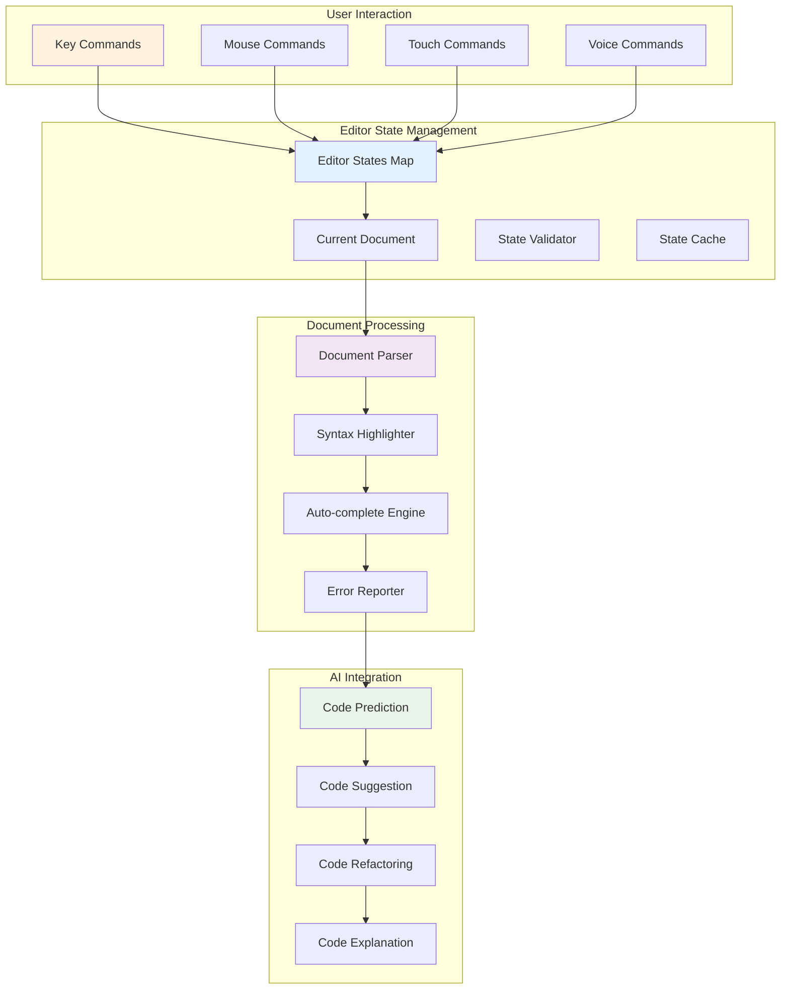
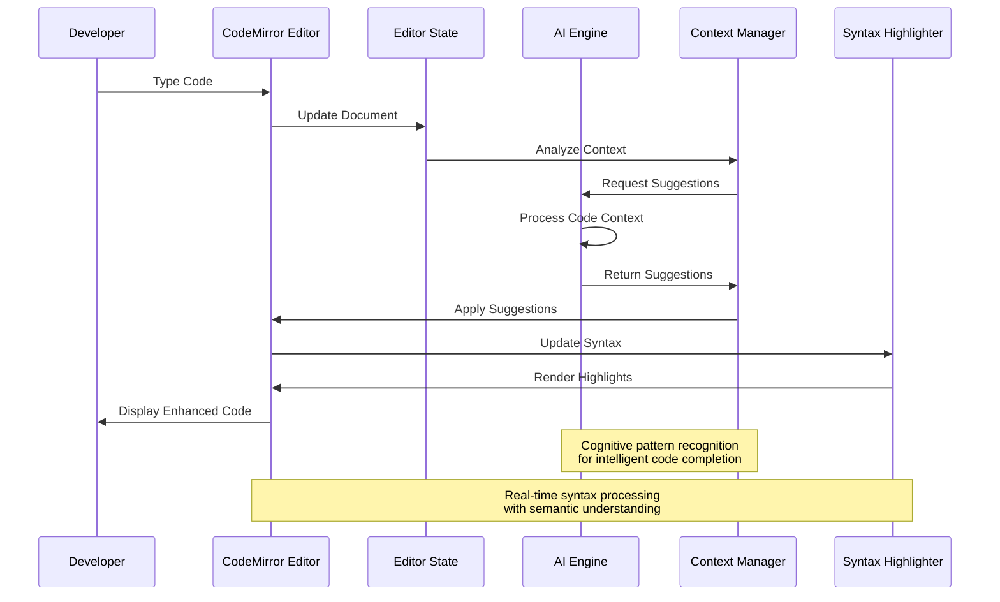
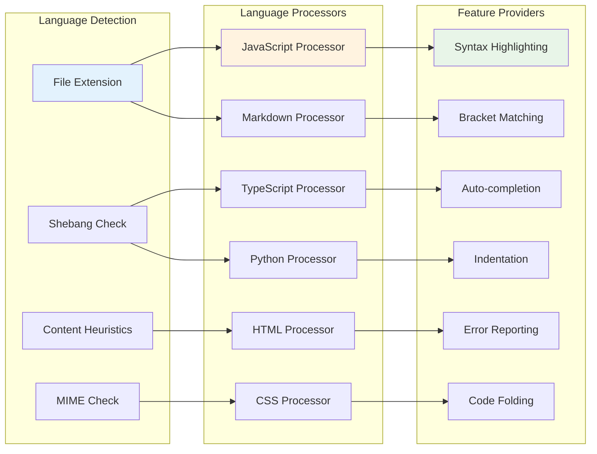
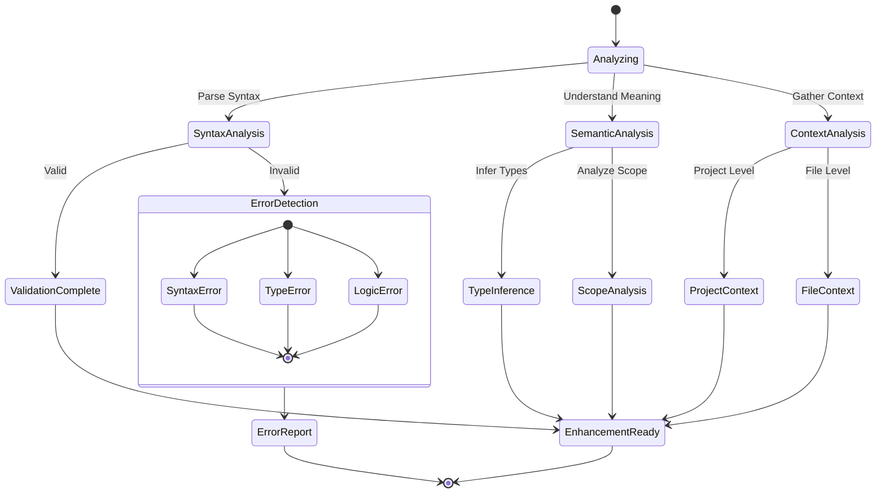
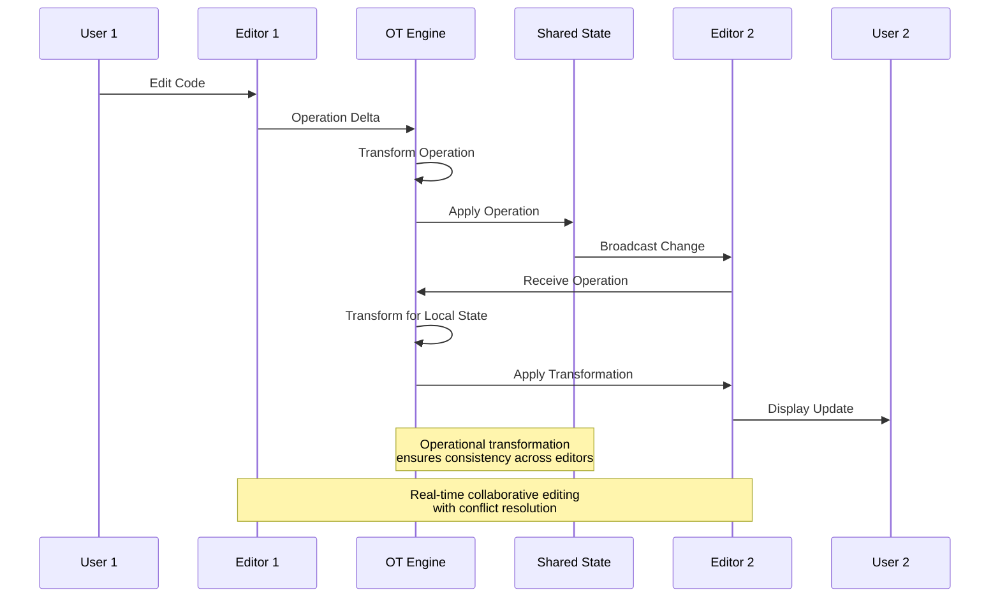
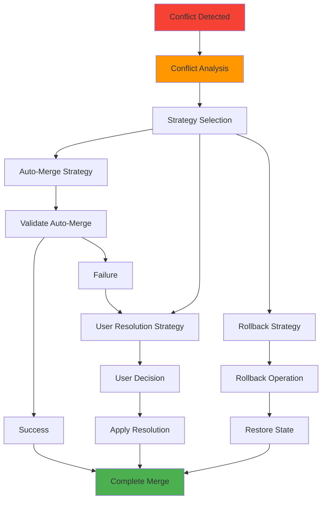
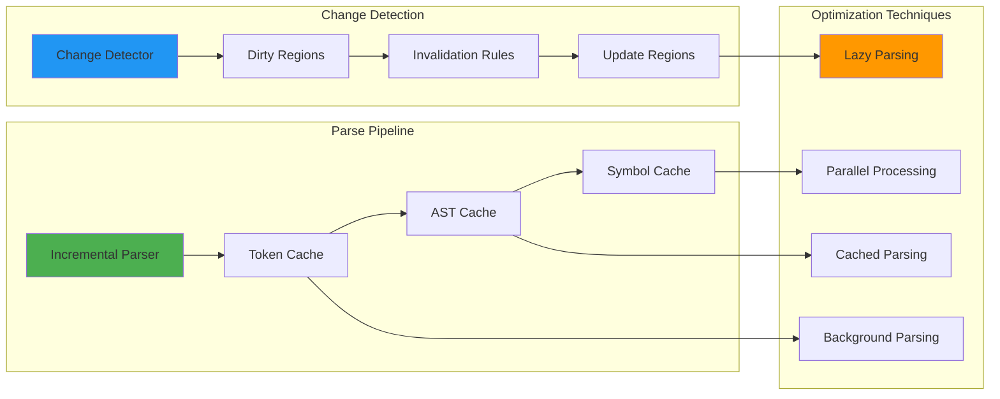
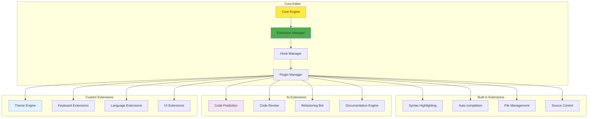
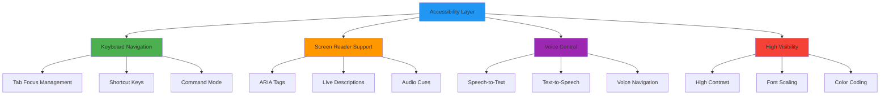

# Code Editor Architecture

## CodeMirror Integration - Cognitive Code Intelligence

The CodeMirror editor integration in bolt-new represents a sophisticated cognitive interface that bridges human code intention with AI-assisted development, implementing adaptive attention mechanisms for transcendent programming experiences.

## Editor Core Architecture

### Multi-Document Management System

### Adaptive Code Intelligence

## Language Intelligence System

### Multi-Language Support Architecture

### Cognitive Code Analysis

The editor employs advanced cognitive patterns for code understanding:

## Real-time Collaboration Architecture

### Operational Transformation System

### Conflict Resolution Mechanisms

## Performance Optimization Patterns

### Incremental Parsing Strategy

### Adaptive Rendering

The editor implements cognitive rendering patterns:

- **Viewport Optimization**: Only render visible lines with lookahead buffering
- **Progressive Enhancement**: Basic rendering first, then add advanced features
- **Semantic Highlighting**: Color-code based on semantic meaning, not just syntax
- **Attention-Guided Rendering**: Prioritize rendering based on user focus patterns

## Extension and Plugin Architecture

### Modular Extension System

## Accessibility and Usability

### Universal Design Principles

The editor implements comprehensive accessibility:

This architecture enables:

- **Adaptive User Interfaces**: Interface adapts to user capabilities and preferences
- **Cognitive Load Reduction**: Information presented in optimal cognitive chunks
- **Multi-Modal Interaction**: Multiple ways to interact with the same functionality
- **Intelligent Assistance**: Context-aware help and guidance systems

The editor represents a transcendent code editing experience that bridges human cognitive patterns with AI-assisted development, creating an emergent intelligence platform for software creation.