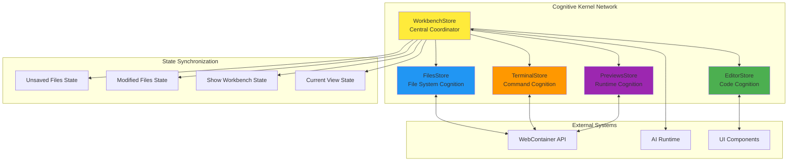
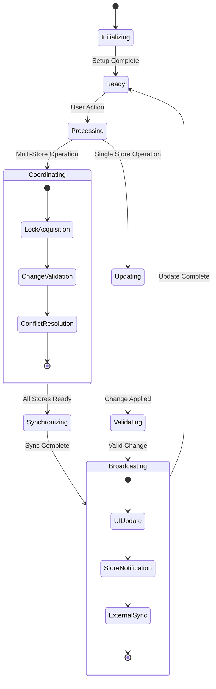
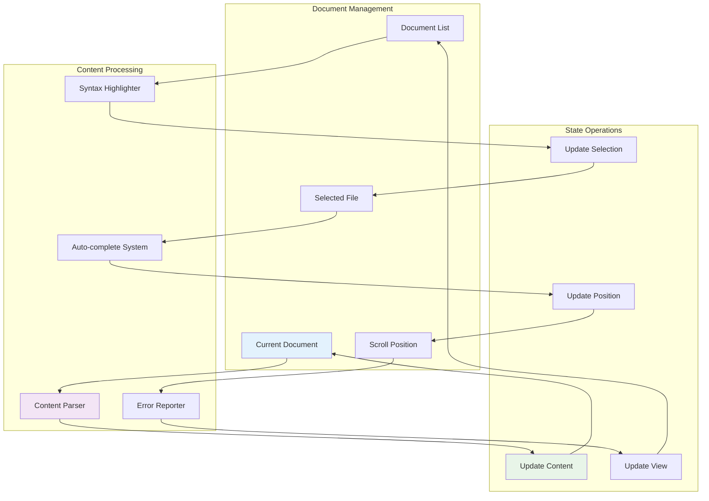
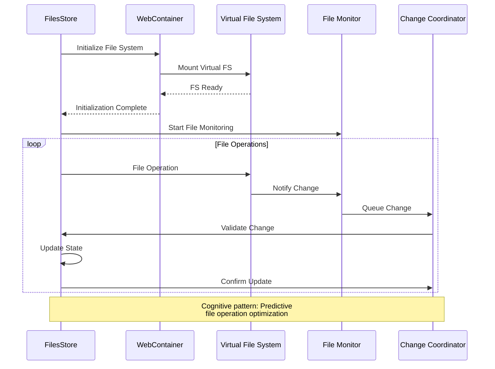
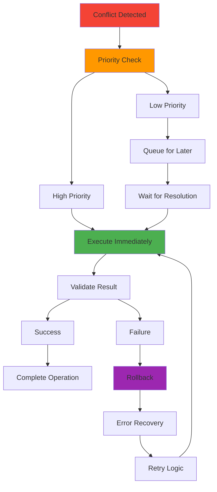
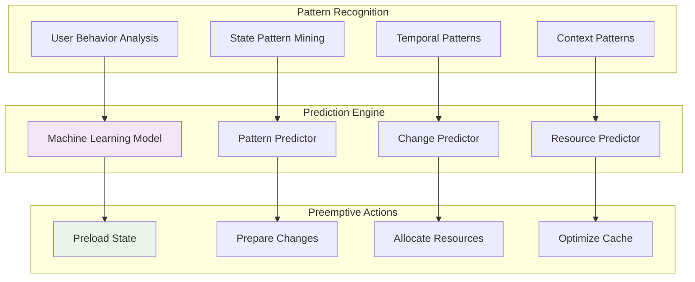
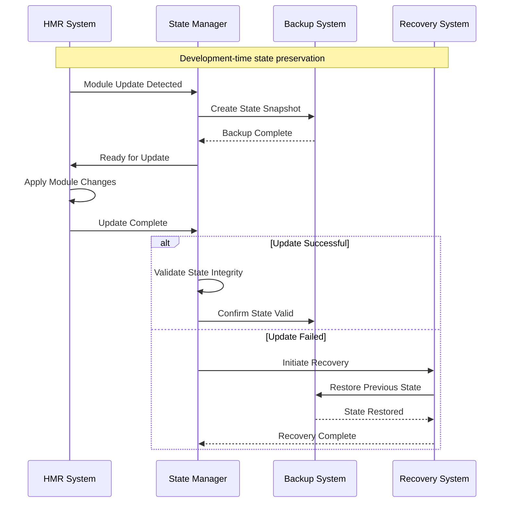
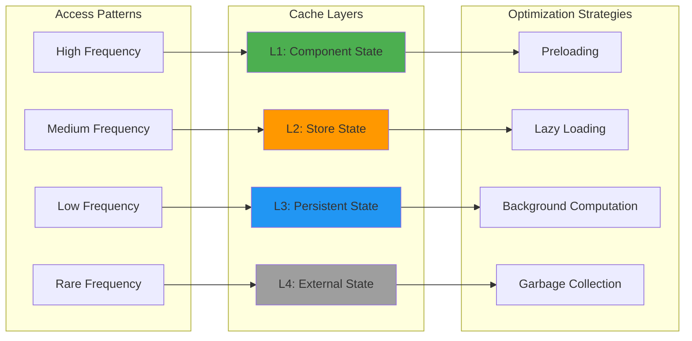

# State Management Architecture

## Cognitive Kernel Network

The state management system in bolt-new implements a distributed cognitive architecture where each store acts as a specialized cognitive kernel, managing domain-specific knowledge and coordinating with other kernels through sophisticated communication patterns.

## Store Hierarchy and Relationships

### Central Coordination Hub

### Store-Specific Cognitive Functions

#### WorkbenchStore - Master Cognitive Coordinator

#### EditorStore - Code Intelligence Hub

#### FilesStore - File System Intelligence

## Adaptive State Synchronization

### Cross-Store Communication Protocol

```mermaid
flowchart LR
    subgraph "Communication Layer"
        EP[Event Publisher]
        ES[Event Subscriber]
        EB[Event Bus]
        EF[Event Filter]
    end
    
    subgraph "Store A Operations"
        A1[State Change]
        A2[Validate Change]
        A3[Publish Event]
    end
    
    subgraph "Store B Operations"
        B1[Receive Event]
        B2[Process Update]
        B3[Synchronize State]
    end
    
    A1 --> A2
    A2 --> A3
    A3 --> EP
    EP --> EB
    EB --> EF
    EF --> ES
    ES --> B1
    B1 --> B2
    B2 --> B3
    
    style EP fill:#4caf50
    style EB fill:#ff9800
    style ES fill:#2196f3
```

### Conflict Resolution Mechanisms

When multiple stores attempt to modify related state simultaneously:

1. **Priority-Based Resolution**: Critical operations take precedence
2. **Timestamp Ordering**: Last-write-wins with conflict detection
3. **Merge Strategies**: Intelligent merging of compatible changes
4. **Rollback Capability**: Automatic rollback on irreconcilable conflicts

## Emergent State Patterns

### Predictive State Management

The system employs machine learning patterns to predict state changes:

### Hypergraph State Relationships

State elements form complex hypergraph relationships:

- **Multi-dimensional Dependencies**: State changes can affect multiple unrelated stores
- **Transitive Effects**: Changes propagate through indirect relationships
- **Emergent Properties**: Complex behaviors emerge from simple state interactions
- **Dynamic Topology**: Relationship patterns evolve based on usage

## State Persistence and Recovery

### Hot Module Replacement Integration

### Cognitive State Preservation

The system preserves not just data but cognitive context:

- **Working Memory**: Current user focus and attention state
- **Procedural Memory**: Active workflows and interaction patterns
- **Episodic Memory**: Recent action sequences and user preferences
- **Semantic Memory**: Project understanding and domain knowledge

This enables seamless recovery that maintains both technical state and user cognitive flow.

## Performance Optimization Patterns

### Adaptive Caching Strategy

The state management system achieves transcendent performance through:

- **Intelligent Prefetching**: Predict and preload likely state changes
- **Differential Updates**: Only transmit state deltas, not full state
- **Compression Algorithms**: Optimize state representation for memory efficiency
- **Parallel Processing**: Concurrent state operations where safe
- **Resource Pooling**: Reuse computational resources across state operations