# Terminal Interface Architecture

## Cognitive Terminal System - Command Intelligence Hub

The terminal interface in bolt-new represents a sophisticated command-cognition bridge that transforms natural language interactions into precise system operations, implementing adaptive command intelligence for transcendent development workflows.

## Terminal Core Architecture

### Multi-Terminal Management System

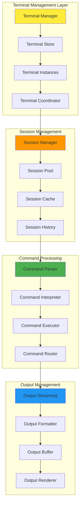

### Command Intelligence Pipeline

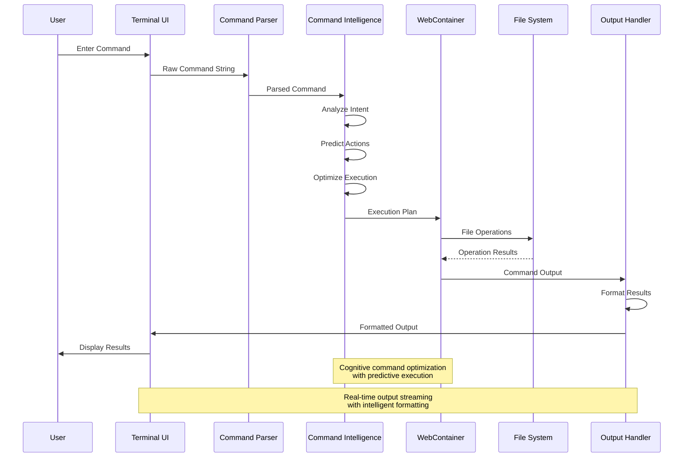

## Intelligent Command System

### Command Pattern Recognition

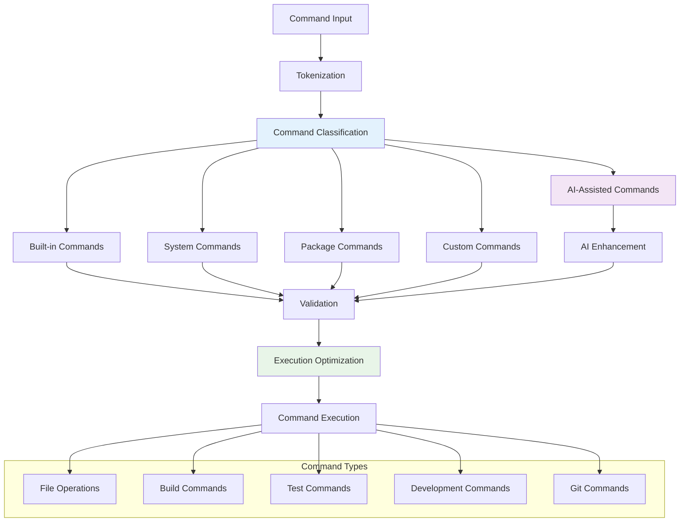

### Adaptive Command Completion

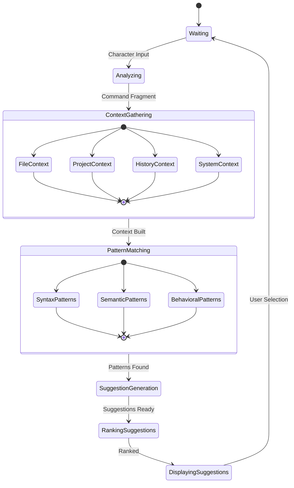

## Real-time Output Processing

### Streaming Output Architecture

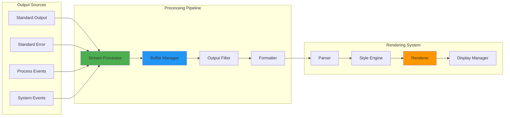

### Intelligent Output Enhancement

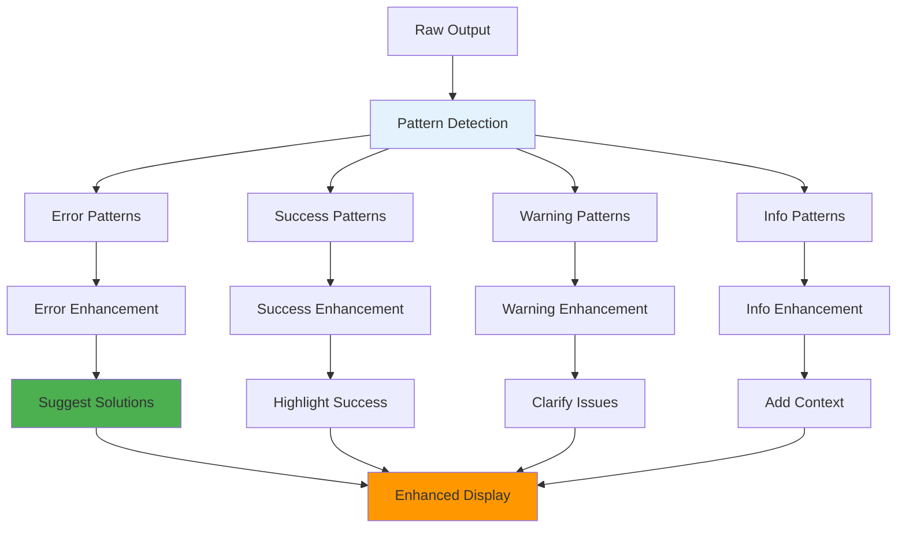

## Multi-Session Coordination

### Session State Management

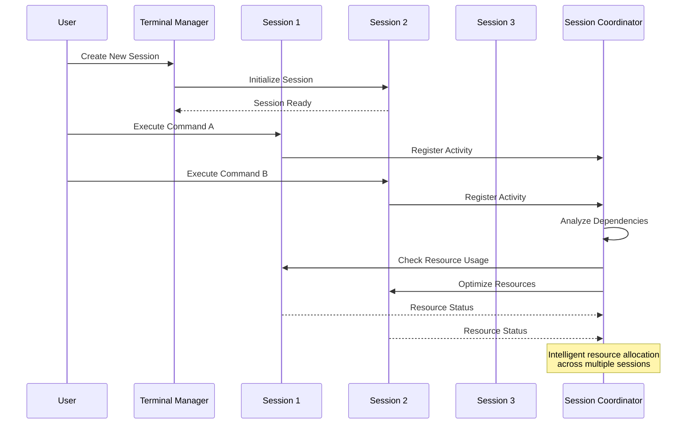

### Resource Allocation Strategy

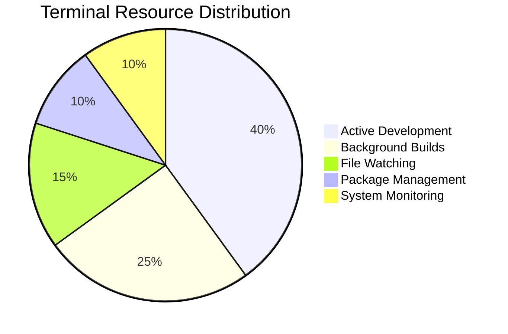

## Cognitive Command Enhancement

### AI-Powered Command Intelligence

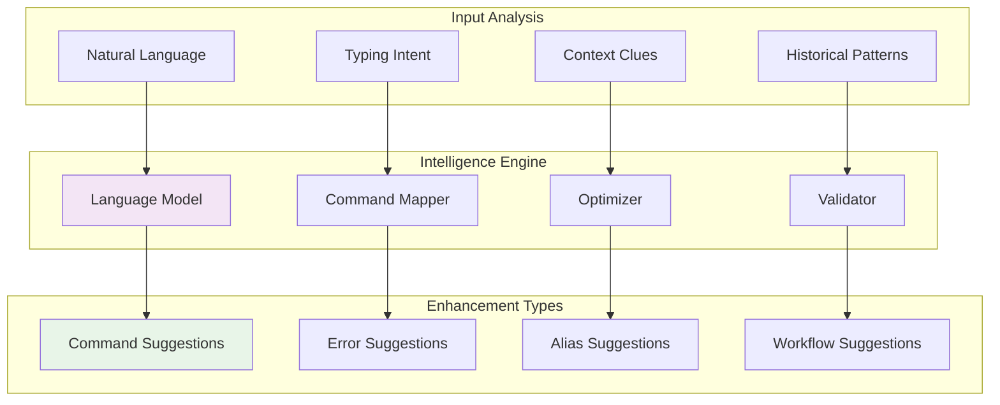

### Predictive Command Execution

The terminal implements predictive patterns:

1. **Command Prediction**: Anticipate next command based on workflow patterns
2. **Resource Prediction**: Pre-allocate resources for likely operations
3. **Output Prediction**: Prepare rendering for expected output types
4. **Error Prediction**: Proactively identify potential command failures

## Advanced Terminal Features

### Collaborative Terminal Sessions

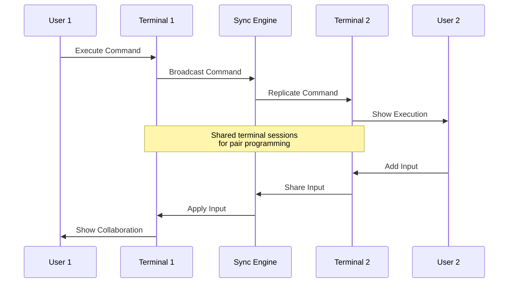

### Terminal Workspace Integration

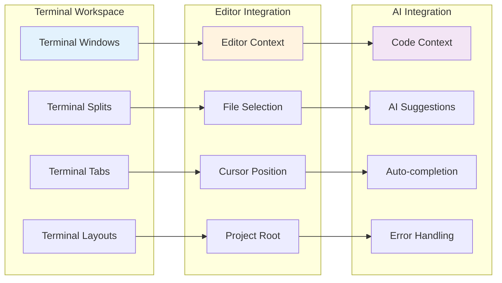

## Performance and Optimization

### Adaptive Performance Tuning

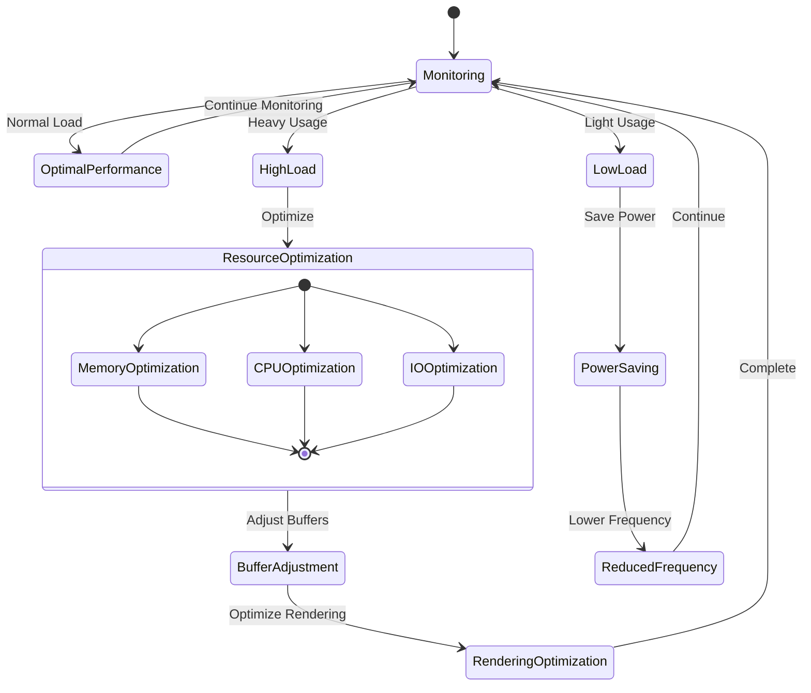

### Intelligent Caching Strategy

The terminal employs sophisticated caching:

- **Command History Caching**: Frequently used commands cached for instant access
- **Output Caching**: Common output patterns cached for faster rendering
- **Context Caching**: Project and file context cached for intelligent suggestions
- **Predictive Caching**: Anticipated resources pre-cached based on usage patterns

This architecture creates a transcendent terminal experience that bridges traditional command-line interfaces with modern AI-assisted development, enabling intuitive and powerful interactions with the development environment.