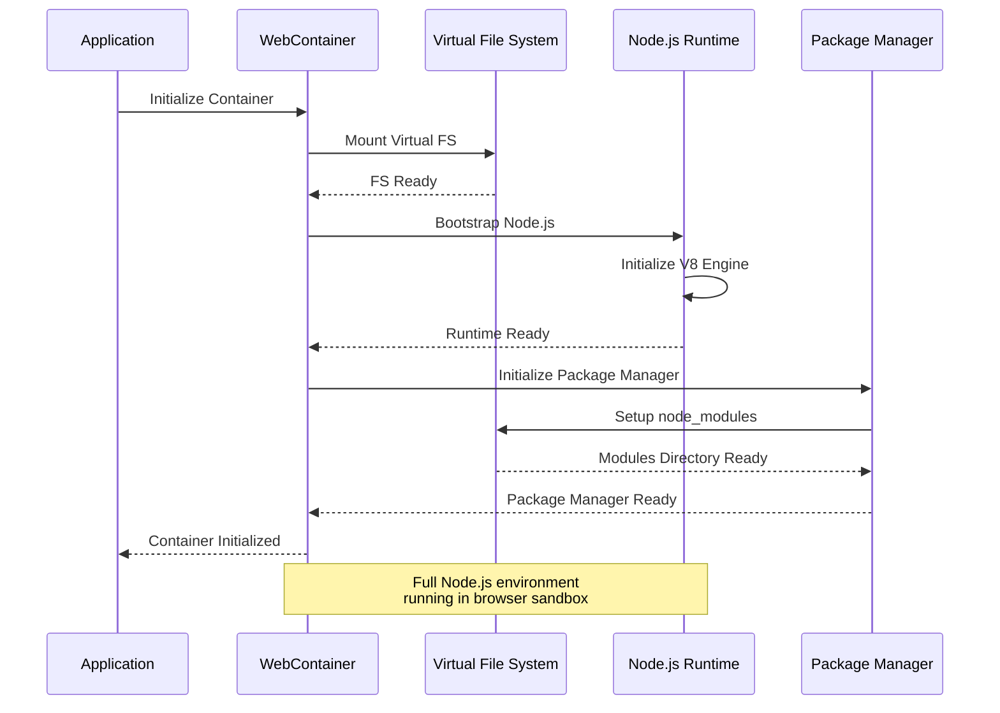
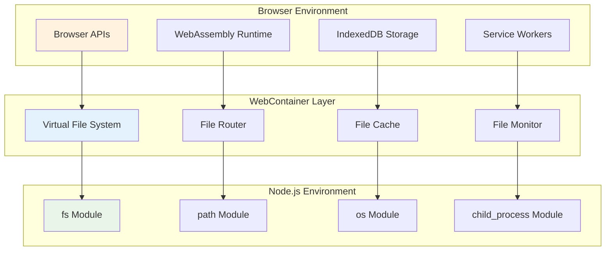
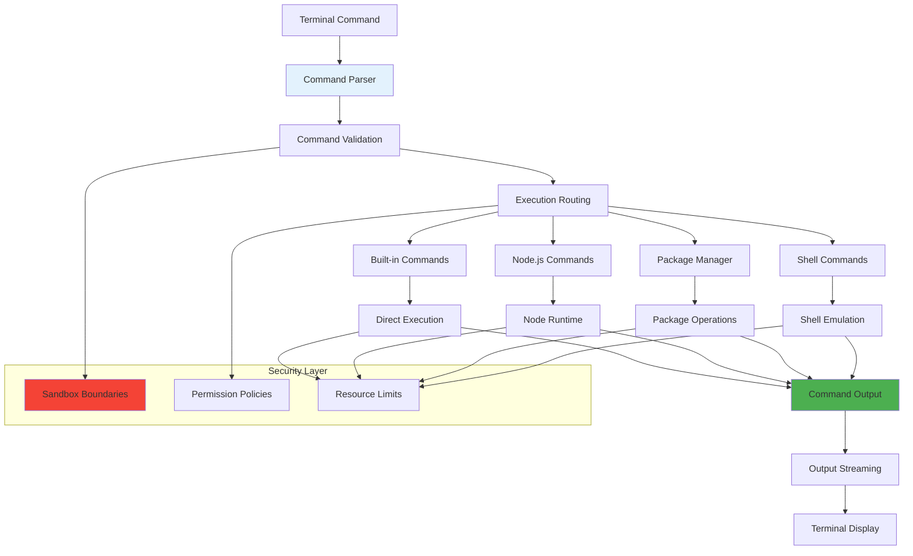
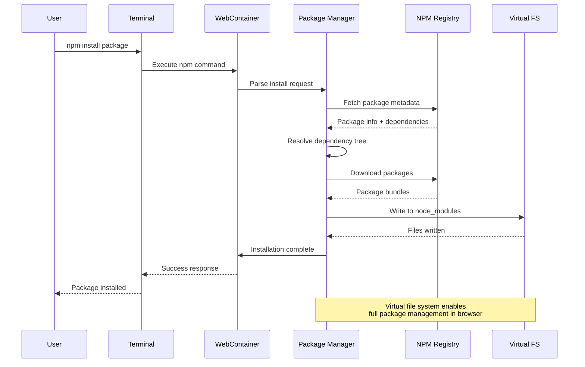
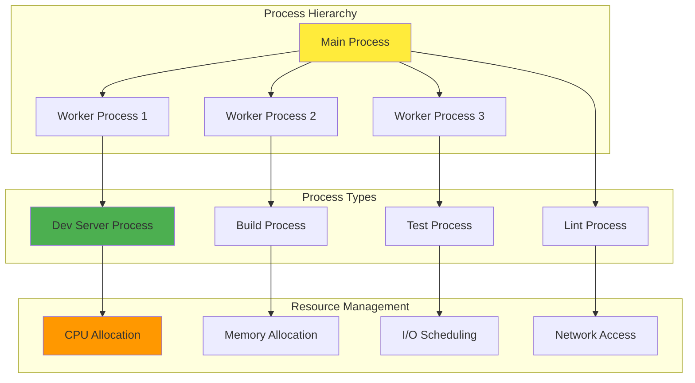
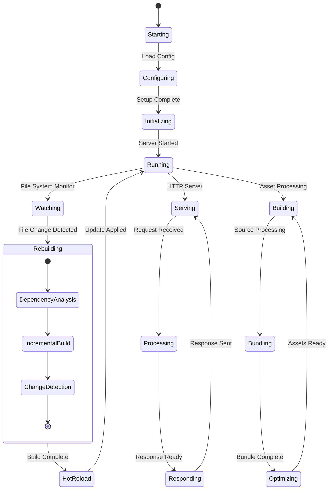
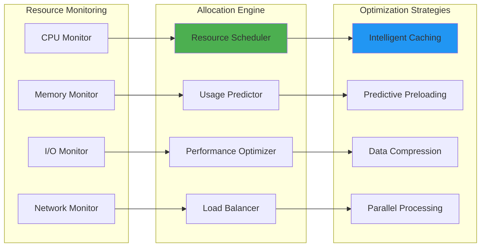
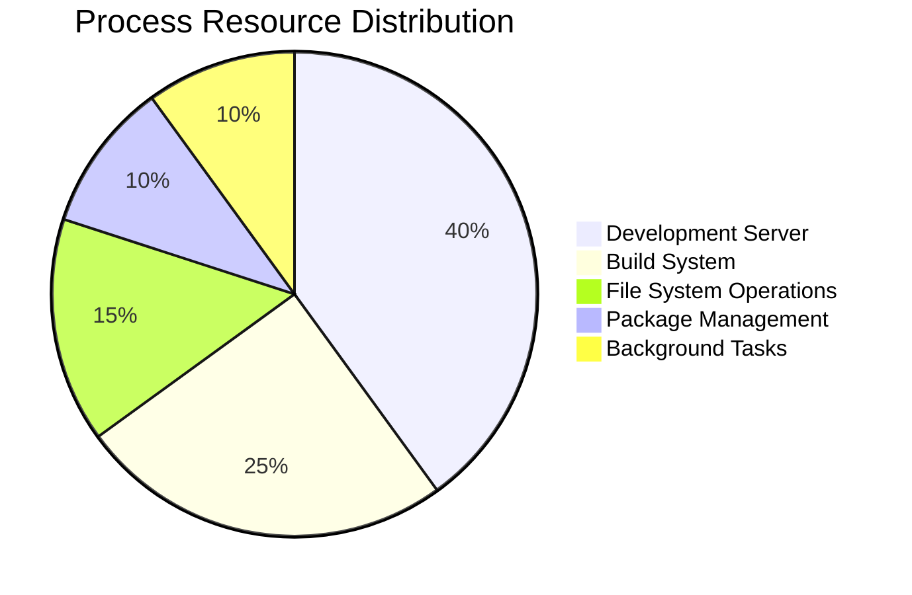
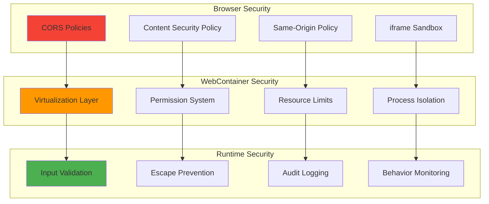
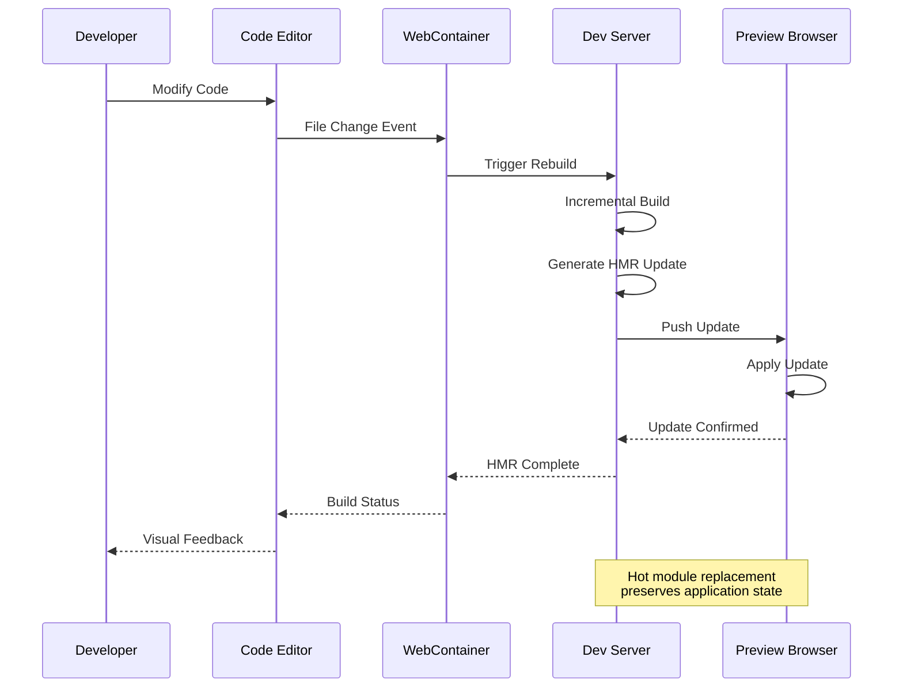

# WebContainer Runtime Architecture

## Sandboxed Execution Environment

The WebContainer integration represents a groundbreaking cognitive-runtime bridge that enables full Node.js environment execution within the browser, creating a transcendent development experience.

## WebContainer Core Architecture

### Runtime Initialization Sequence

### Virtual File System Mapping

## Command Execution Pipeline

### Terminal Command Processing

### Package Management Integration

## Process Management

### Multi-Process Coordination

### Live Development Server

## Runtime Performance Optimization

### Adaptive Resource Allocation

### Cognitive Process Management

The WebContainer employs cognitive patterns for process optimization:

1. **Process Affinity Learning**: Learn which processes work well together
2. **Resource Pattern Recognition**: Identify resource usage patterns
3. **Predictive Scaling**: Anticipate resource needs based on project type
4. **Intelligent Scheduling**: Optimize process execution order

## Security and Sandboxing

### Multi-Layer Security Architecture

### Cognitive Security Patterns

The system implements adaptive security through:

- **Behavior Analysis**: Monitor for unusual process behavior
- **Pattern Recognition**: Identify potentially malicious command patterns
- **Adaptive Restrictions**: Dynamically adjust permissions based on risk
- **Learning Firewalls**: Security rules that evolve based on usage patterns

## Integration with Development Workflow

### Hot Module Replacement

This architecture enables:

- **Instant Feedback**: Changes are reflected immediately in the preview
- **State Preservation**: Application state is maintained during updates
- **Error Recovery**: Graceful handling of build errors and syntax issues
- **Performance Optimization**: Only modified modules are rebuilt and updated

The WebContainer integration represents a paradigm shift in web development, bringing the full power of Node.js environments to the browser while maintaining security, performance, and developer experience transcendence.