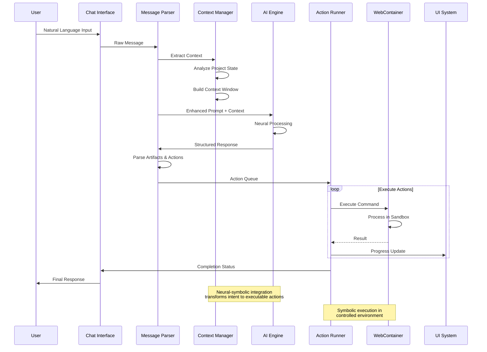
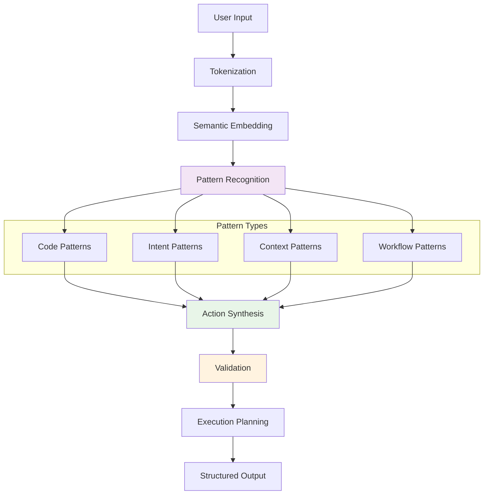
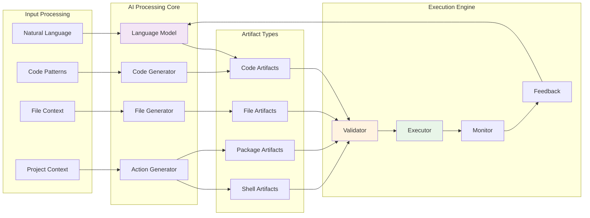
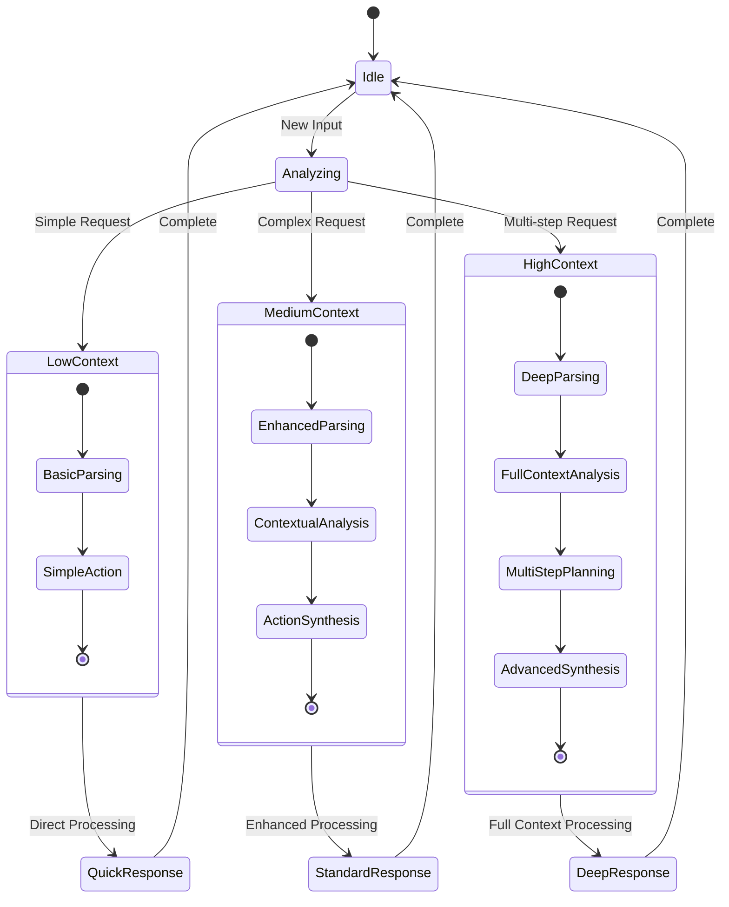
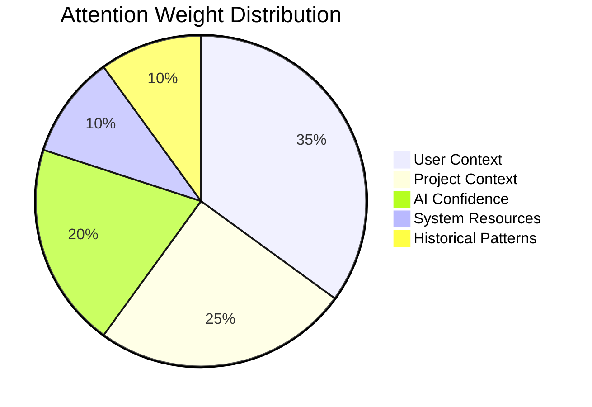
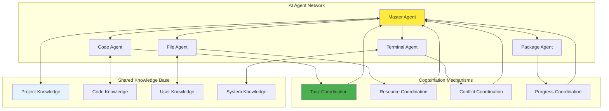
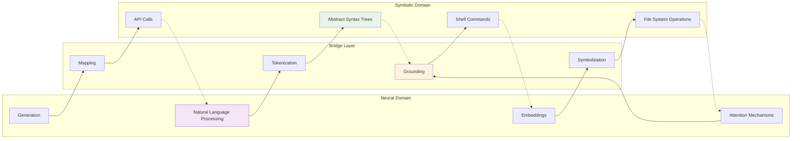

# AI Integration Workflows

## Neural-Symbolic Integration Architecture

The AI integration in bolt-new represents a sophisticated neural-symbolic bridge that enables seamless interaction between human cognition, artificial intelligence, and symbolic computation systems.

## AI Processing Workflow

### Complete AI Interaction Sequence

### Cognitive Pattern Recognition

## Artifact Generation System

### AI Artifact Processing Pipeline

## Adaptive Attention Allocation

### Dynamic Context Management

The system implements sophisticated attention mechanisms to optimize AI processing:

### Contextual Attention Weights

The system dynamically adjusts attention based on multiple factors:

1. **User Attention**: Current cursor position, selected text, active files
2. **Project Attention**: Recently modified files, dependency relationships
3. **AI Attention**: Model confidence levels, previous interaction success
4. **System Attention**: Resource availability, performance metrics

## Emergent Intelligence Patterns

### Multi-Agent Coordination

The system employs multiple AI agents that coordinate to achieve complex goals:

### Recursive Improvement Mechanisms

The AI system continuously improves through recursive feedback loops:

1. **Action Execution Feedback**: Monitor success/failure of generated actions
2. **User Satisfaction Feedback**: Track user acceptance of AI suggestions
3. **Performance Feedback**: Measure execution time and resource usage
4. **Context Accuracy Feedback**: Validate context understanding accuracy

### Cognitive Synergy Optimization

The system achieves emergent intelligence through:

- **Cross-Modal Learning**: Knowledge transfer between different interaction modes
- **Pattern Amplification**: Successful patterns are reinforced and generalized
- **Failure Learning**: Failed attempts inform future decision making
- **Contextual Adaptation**: System behavior adapts to user and project patterns

## Neural-Symbolic Bridge Architecture

### Symbol Grounding

The system bridges neural processing with symbolic execution through:

This architecture enables:

- **Semantic Preservation**: Meaning is preserved across neural-symbolic transformations
- **Bidirectional Flow**: Information flows both from neural to symbolic and back
- **Error Correction**: Symbolic validation can correct neural generation errors
- **Continuous Learning**: Symbolic execution results inform neural model improvements