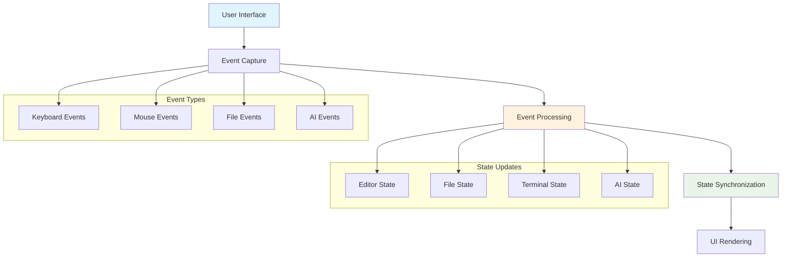
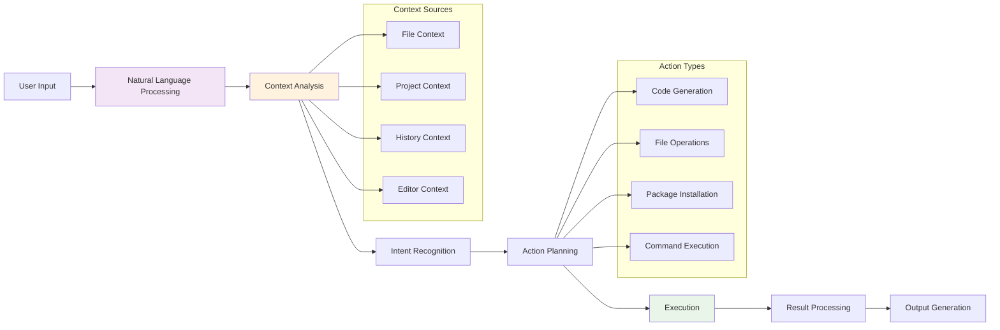
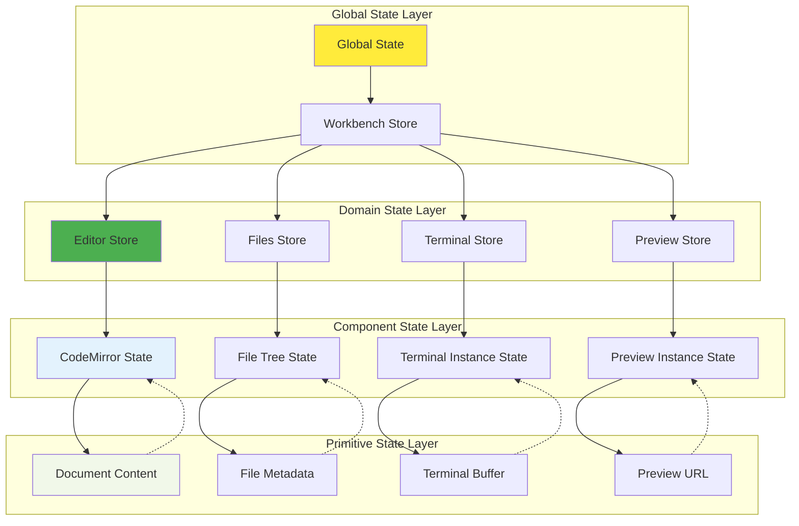
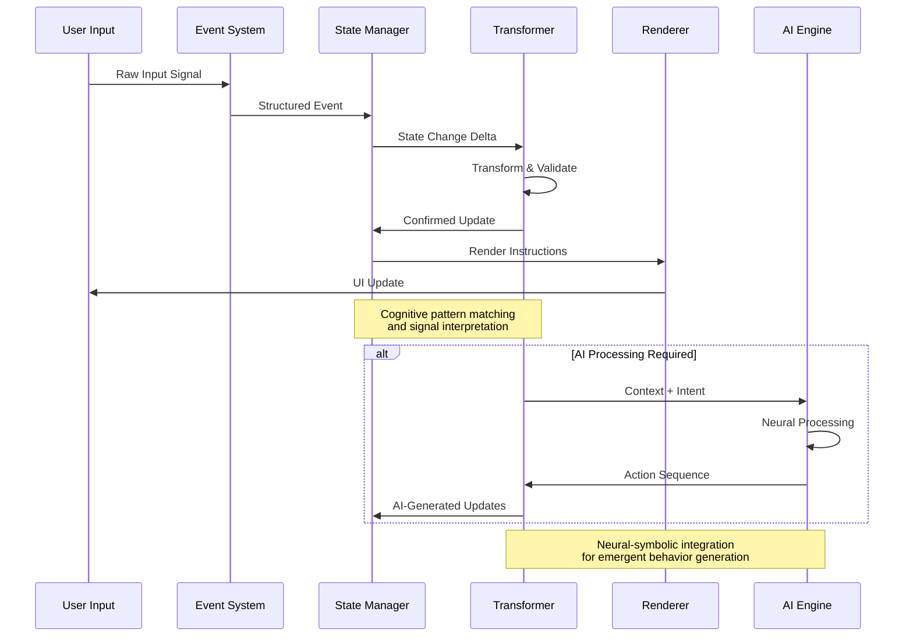
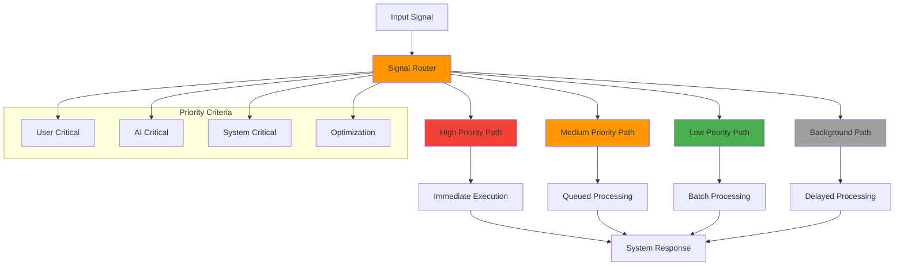
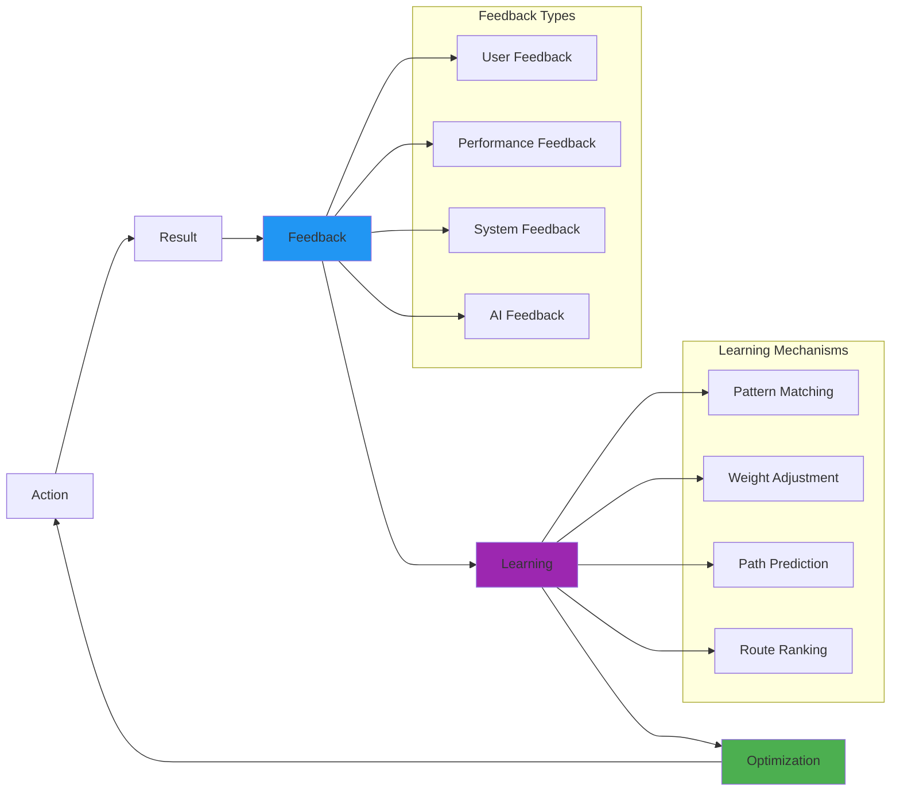

# Data Flow Architecture

## Signal Propagation Pathways

The bolt-new system implements sophisticated signal propagation patterns that enable real-time coordination between cognitive subsystems.

## Primary Data Flow Patterns

### 1. User Interaction Flow

### 2. AI Processing Pipeline

## Recursive Data Propagation

### Hierarchical State Management

## Signal Transformation Pipeline

### Real-time Data Processing

## Adaptive Signal Routing

### Dynamic Pathway Selection

The system employs adaptive routing mechanisms to optimize signal propagation:

## Emergent Data Patterns

### 1. Contextual Awareness Propagation

Information flows through the system with increasing contextual enrichment:

- **Raw Data**: Basic user inputs and system events
- **Structured Data**: Parsed and categorized information
- **Contextual Data**: Information enriched with project context
- **Intelligent Data**: AI-processed data with intent and recommendations

### 2. Feedback Loop Integration

### 3. Hypergraph Data Relationships

The system maintains data relationships as a hypergraph structure:

- **Multi-dimensional Connections**: Data elements connect through multiple relationship types
- **Dynamic Edge Weights**: Relationship strength adapts based on usage patterns
- **Emergent Clusters**: Related data naturally groups into cognitive clusters
- **Cross-Domain Bridges**: Information flows between different system domains

This enables:
- **Contextual Recommendations**: AI suggestions based on multi-faceted data relationships
- **Predictive Preloading**: Anticipate data needs based on relationship patterns
- **Intelligent Caching**: Cache data clusters likely to be accessed together
- **Fault-Tolerant Recovery**: Multiple data pathways ensure system resilience