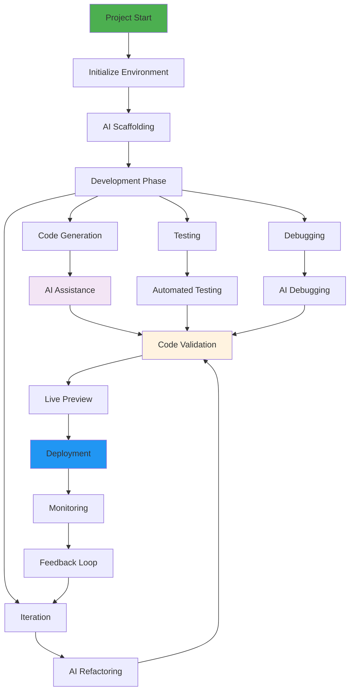
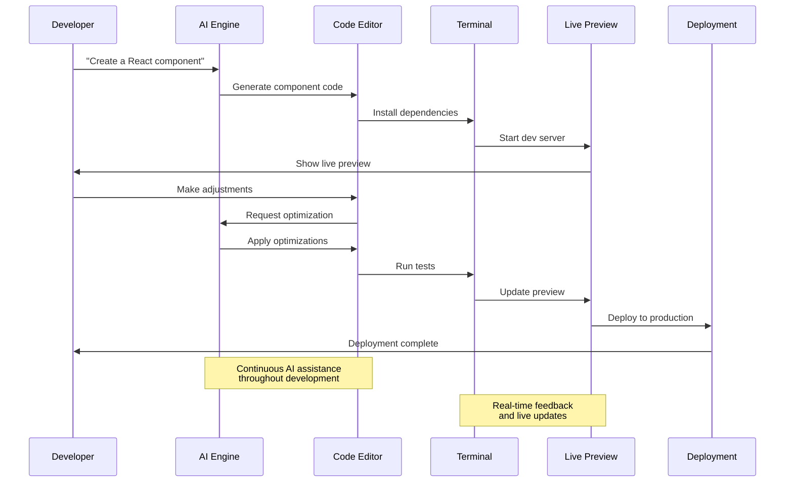
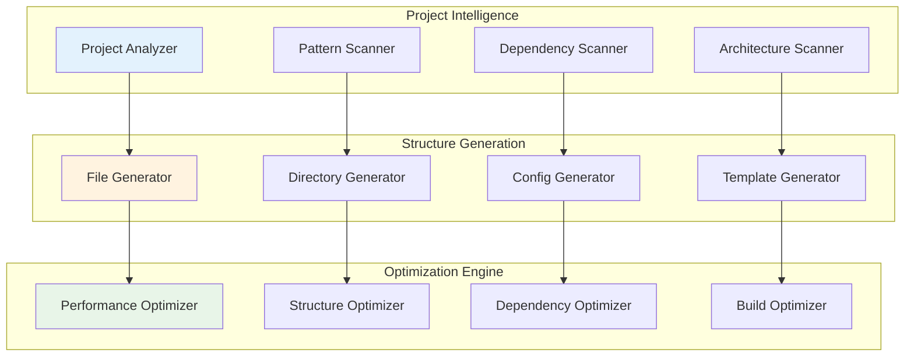
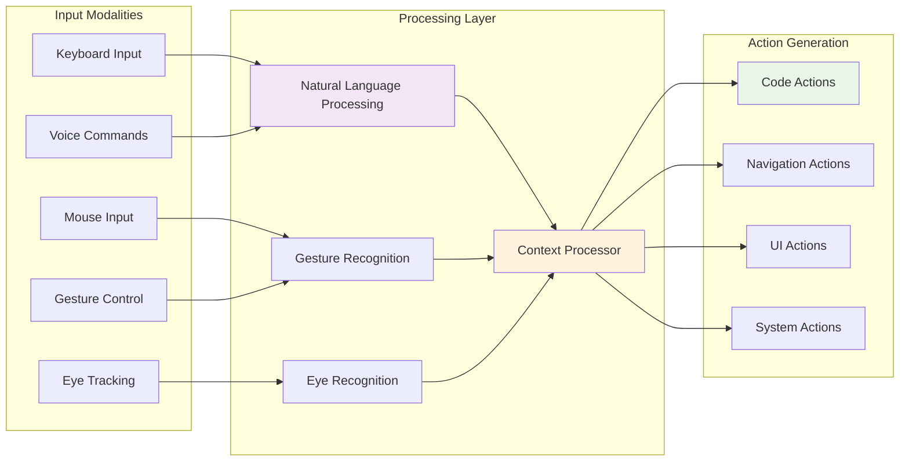
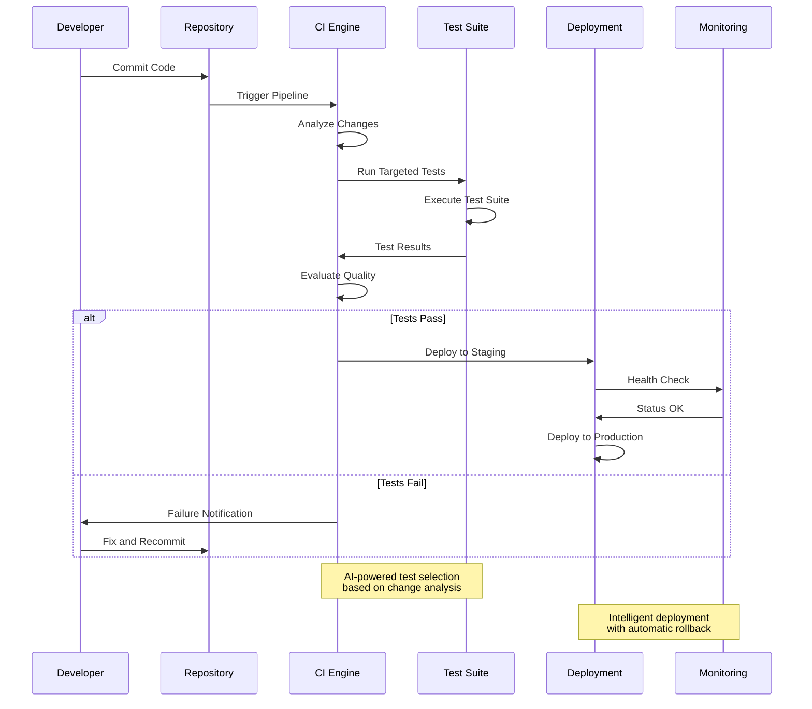
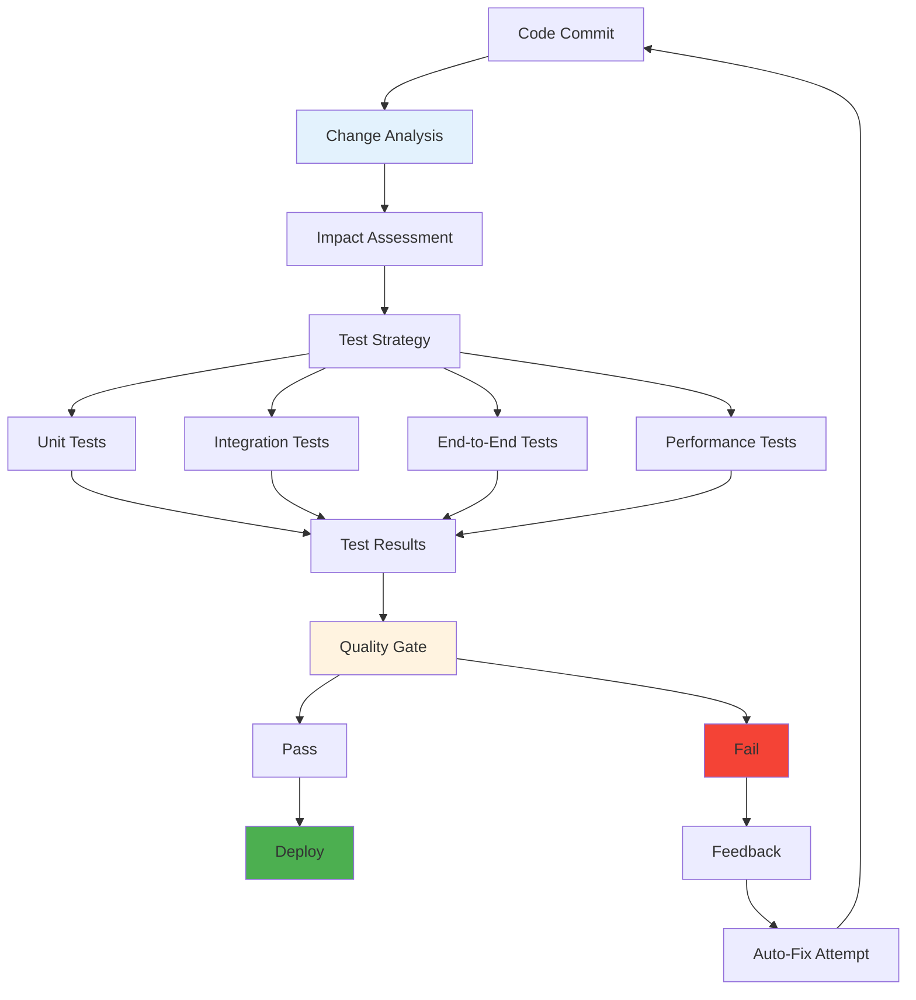
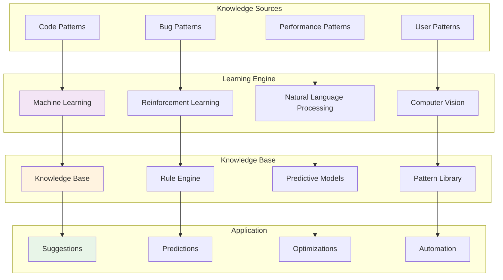
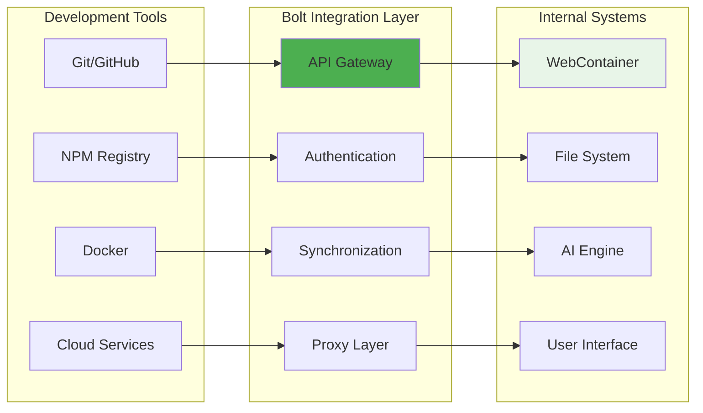
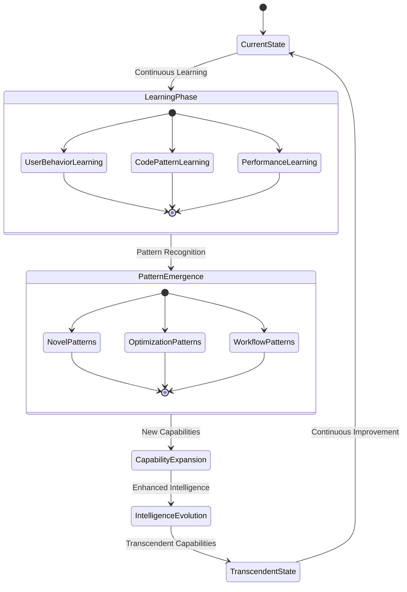

# Development Workflow Integration

## Comprehensive Development Lifecycle

The bolt-new system orchestrates a complete development lifecycle that seamlessly integrates AI assistance, real-time collaboration, and intelligent automation through emergent cognitive patterns.

## End-to-End Development Flow

### Project Initialization to Deployment

### Cognitive Workflow Optimization

## Intelligent Project Management

### Adaptive Project Structure

### Emergent Architecture Patterns

The system recognizes and adapts to emerging architecture patterns:

1. **Pattern Recognition**: Identify common architectural patterns in use
2. **Pattern Suggestion**: Recommend improvements based on best practices
3. **Pattern Evolution**: Adapt patterns based on project-specific needs
4. **Pattern Optimization**: Continuously optimize for performance and maintainability

## Multi-Modal Development Experience

### Integrated Development Interface

## Continuous Integration and Deployment

### Intelligent CI/CD Pipeline

### Adaptive Quality Assurance

## Knowledge Management and Learning

### Continuous Learning System

## Ecosystem Integration

### External Tool Integration

### Cognitive Ecosystem Orchestration

The system creates an intelligent ecosystem that:

- **Learns from Integration**: Improves based on external tool usage patterns
- **Predicts Needs**: Anticipates required integrations based on project context
- **Optimizes Workflows**: Streamlines interactions between different tools
- **Maintains Coherence**: Ensures consistent experience across all integrations

## Future Evolution Pathways

### Emergent Intelligence Development

This comprehensive integration represents the actualization of the cognitive flowchart vision, where distributed cognition enables transcendent development experiences through adaptive, hypergraph-centric architecture that continuously evolves and optimizes for peak developer productivity and creative expression.